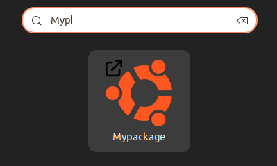

# Create your debian package

A simple tutorial to create and install your very own deb package.

## Pre-requisite

Nothing but a Debian, Ubuntu or any Debian-based OS :sparkles:

## Architecture and notes

The _Mypackage_ app will open [Ubuntu's official website](https://ubuntu.com) when run.

Nomenclature of our `mypackage_1.0_all` folder : `package-name_version_architecture`.

- Package name : `mypackage`
- Version : `1.0`
- Architecture : could be `all` or a subset of [supported architectures](https://wiki.debian.org/SupportedArchitectures)

Raw package architecture :

```txt
.
└── mypackage_1.0_all                   # Package main folder
    ├── DEBIAN
    │   ├── control                     # File with package's main info
    │   ├── postinst                    # Script executing after the install
    │   └── preinst                     # Script executing before the install
    ├── opt
    │   └── mypackage                   # Folder including our software
    │       └── open_link.sh            # Script opening browser to ubuntu.com
    └── usr
        └── share
            ├── applications
            │   └── mypackage.desktop   # File with app info in launcher
            └── icons
                └── mypackage.xpm       # Launcher app icon
```

More about the [`DEBIAN/control`](./mypackage_1.0_all/DEBIAN/control) file :

```conf
Package: mypackage
Version: 1.0            # package version
Architecture: all       # our package sums up to a bash script and this is POSIX
Essential: no           # essential to the system ?
Priority: optional      # install order in package management system
Depends: curl,zenity    # comma-separated dependency packages (,)
Maintainer: flavienbwk
Description: A sample package...
```

Although there are [ways to install deb archives without sudo](https://askubuntu.com/a/342/611107), most deb packages are designed to be installed system-wide. This means that _preinst_ and _postinst_ scripts or any other binary included in the archive can run without any restriction on one's system (see [_Snap packages_](#a-word-about-snap-packages) for an alternative). Triple-check your scripts and be careful when sharing so you don't break someone's computer.

## Getting started

1. Build

    ```bash
    dpkg-deb --build ./mypackage_1.0_all
    ```

2. Install

    ```bash
    sudo gdebi -n ./mypackage_1.0_all.deb # test (requires gdebi-core)
    sudo dpkg -i ./mypackage_1.0_all.deb # install
    ```

    > **Note**
    > Uninstall with `sudo apt autoremove mypackage`

You should see _Mypackage_ in your launcher :



## Install from the APT CLI

The first option is the easiest : we can [install packages locally](https://rpmdeb.com/devops-articles/how-to-create-local-debian-repository/).

1. Create a folder where our repository will be located and move our `.deb` package inside

    ```bash
    mkdir -p ./mirror/pool
    cp ./mypackage_1.0_all.deb ./mirror/pool/
    ```

2. Create the `Packages` index file

    ```bash
    cd ./mirror
    dpkg-scanpackages -m ./pool > Packages
    ```

3. Add the directory to your system's sources

    ```bash
    echo "deb [trusted=yes] file:/path/to/repository/mirror /" | sudo tee /etc/apt/sources.list.d/mypackage.list
    ```

4. Update your packages definition and install

    ```bash
    sudo apt update
    sudo apt install mypackage
    ```

Locally-installed repositories can then be served from a simple Apache server [on your own machine](https://github.com/flavienbwk/apt-mirror-docker).

You may choose to [create your Personal Package Archive (PPA)](https://help.launchpad.net/Packaging/PPA), hosted on , then accessible from everyone with a simple `add-apt-repository ppa:<repository_name>` command.

<!--
Thank you ChatGPT for pointing out resources. It's not easy to get all details about the full publishing procedure :
https://chat.openai.com/share/b825067e-754c-4516-933a-2e569772c6fa
-->

If you want your package to get published into Ubuntu's universe/multiverse repositories, [it may get tricky](https://wiki.ubuntu.com/REVU2Spec) as you should get the approval of a [MOTU](https://wiki.ubuntu.com/MOTU). Want to publish it to main ? That's [a lot of conditions to meet](https://github.com/canonical/ubuntu-mir#main-inclusion-requirements) including security and commitment to maintenance criterias.

## A word about META packages

[META packages](https://terokarvinen.com/2011/create-deb-metapackage-in-5-minutes/) are packages that install nothing but a list of dependencies.

That's how you can install a whole desktop through one package.

## A word about snap packages

APT is the traditional package management system used by Debian and its derivatives (incuding Ubuntu). It debuted in 1998 and uses `.deb` packages.

[Snap, introduced by Canonical in 2014](https://snapcraft.io/docs/creating-a-snap), is a newer package manager designed to provide easier package distribution across different Linux distributions. It bundles dependencies within each `.snap` package, leading to larger package sizes but mitigating "dependency hell". This comes useful especially in offline systems.

The key differences is that snap packages focus on cross-distribution compatibility and self-containment, potentially better security through [package sandboxing](https://snapcraft.io/docs/creating-a-snap), and automatic updates. APT, on the other hand, relies on system-wide libraries, which makes packages smaller but can cause dependency issues.
